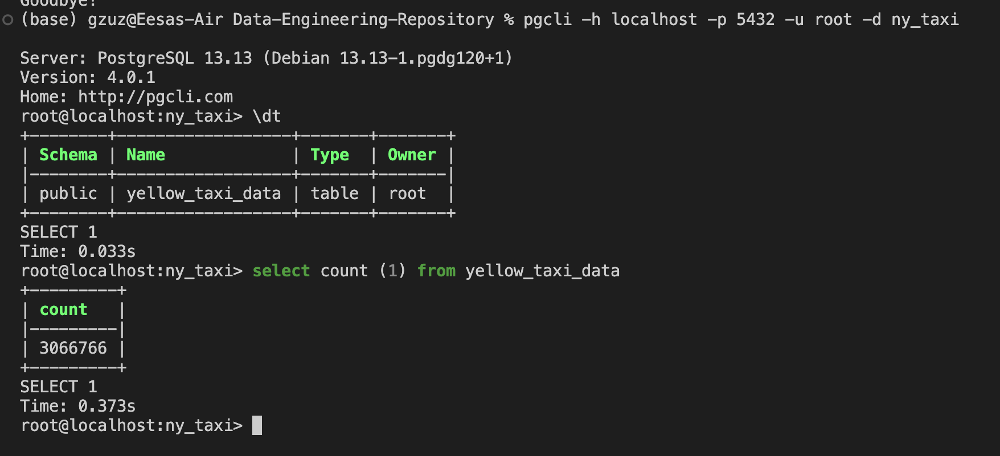

# Setting up a postgreSQL database in docker and ingesting data

**This guide outlines the process for setting up a PostgreSQL database in a Docker container and ingesting data for analysis.**

### Running a PostgreSQL Docker Container

Run the following command in the terminal to pull and run the PostgreSQL container:
```bash
docker run -d \
-e POSTGRES_USER="root" \
-e POSTGRES_PASSWORD="root" \
-e POSTGRES_DB="ny_taxi" \
-v $(pwd)/ny_taxi_postgres_data:/var/lib/postgresql/data \
-p 5432:5432 \
postgres:13
```
- `docker run -d` runs the container in the background allowing you to still use the command interface
- for an interactive session, use: 
```
docker run -it
```

### Connecting to the PostgreSQL Database using `pgcli`

**Ensure that pgcli is installed:**
- For command line interface use:
```bash
!pip install pgcli
```
- In python or jupyter environment, use:
```bash
pip install pgcli
```
Follow the steps outlined in this notebook to batch transfer the data into the PostgresSQL database:
[data-upload-to-postgres.ipynb](data-upload-to-postgres.ipynb)

**Data Source:**
> https://www.nyc.gov/site/tlc/about/tlc-trip-record-data.page

- Select January 2023 dropdown > (2023 January, "Yellow Taxi Trip Records")

Run this command to connect to the PostgreSQL database:
```bash
pgcli -h localhost -p 5432 -u root -d ny_taxi 
```


#
### Running pgAdmin in a Docker Container
**To manage the PostgreSQL database through a web interface, run pgAdmin using this command:**
```bash
docker run -d \
-e PGADMIN_DEFAULT_EMAIL="admin@admin.com" \
-e PGADMIN_DEFAULT_PASSWORD="root" \
-p 8080:80 \
dpage/pgadmin4
```
- Access pgAdmin by navigating to "localhost:8080" in a web browser and log in using the specified email and password.
#

### Networking
Create a Docker network to facilitate communication between PostgreSQL database and pgAdmin:
```bash
docker network create pg-network
```

### Connecting PostgreSQL and pgAdmin on the Same Network

Reconfigure both services to add them to the network

PostgreSQL Database with Network Configuration:
```bash
docker run -it \
-e POSTGRES_USER="root" \
-e POSTGRES_PASSWORD="root" \
-e POSTGRES_DB="ny_taxi" \
-v $(pwd)/ny_taxi_postgres_data:/var/lib/postgresql/data \
-p 5432:5432 \
--network=pg-network \
--name pg-database \
postgres:13
```

pgAdmin with Network Configuration:
```bash
docker run -it \
-e PGADMIN_DEFAULT_EMAIL="admin@admin.com" \
-e PGADMIN_DEFAULT_PASSWORD="root" \
-p 8080:80 \
--network=pg-network \
--name pgadmin \
dpage/pgadmin4
```
- Container naming (--name) helps in identifying and managing containers, especially when handling multiple instances.
#

### Alternative method to interact with the PostgreSQL database can be found here: [jupyter-to-postgres-connection.ipynb](jupyter-to-postgres-connection.ipynb)