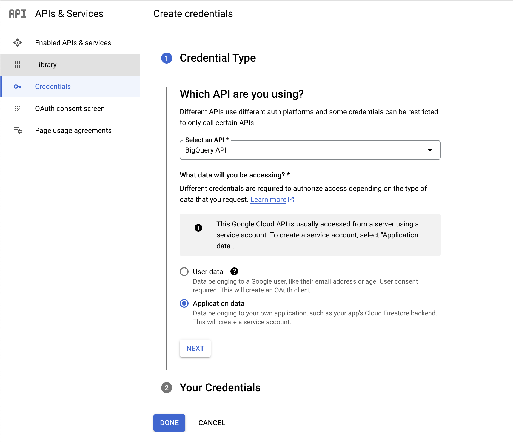

## Create API and Service Account for dbt connection

**1. Navigate to API's & Services**
- select help me choose and select the following options:

- once completed select next

**2. Service Account**
- Fill in the service account details and select bigquery admin for roles
> NOTE: since I am the sole user, bigquery admin permission are okay. However, in can open security risks in the event there are multople users.
- once completed, select done.

**3. JSON Key**
- Select the service acct that was just created
- navigate to the keys menu and add create a new JSON key

**4. Upload JSON Key to dbt**
- Select bigquery as the data warehouse for the connection
- upload the JSON key, complete configurations, and test the connection
- git clone desired repository for version control
- dbt will generate a deploy key which will need to be uploaded to the desired repo under security > deploy keys

