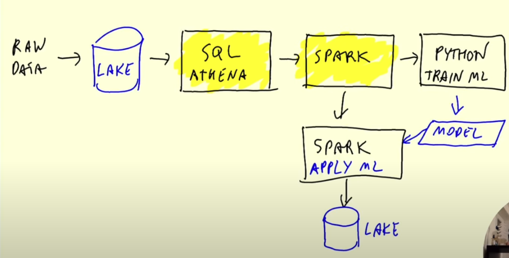
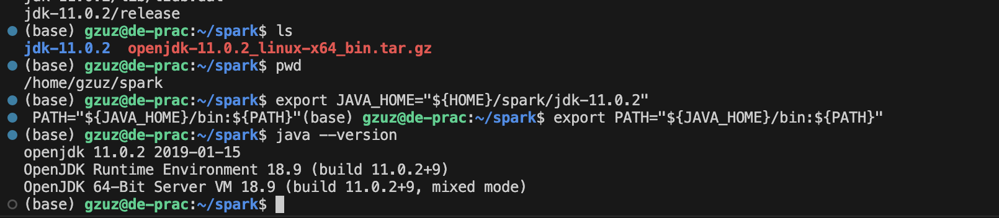
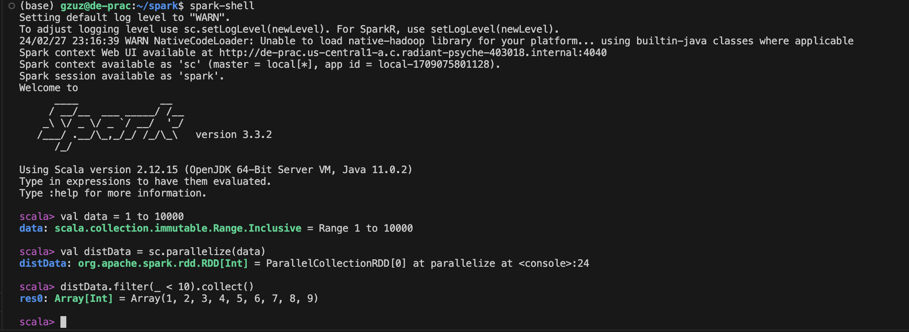
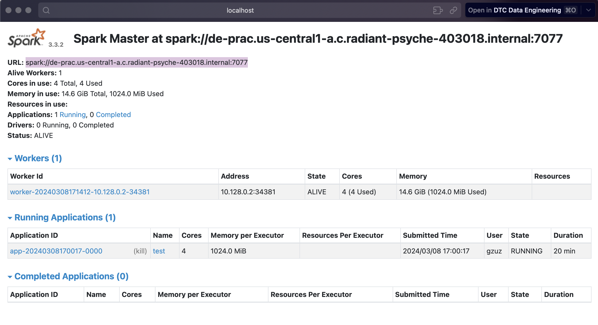
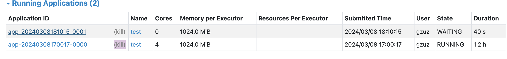
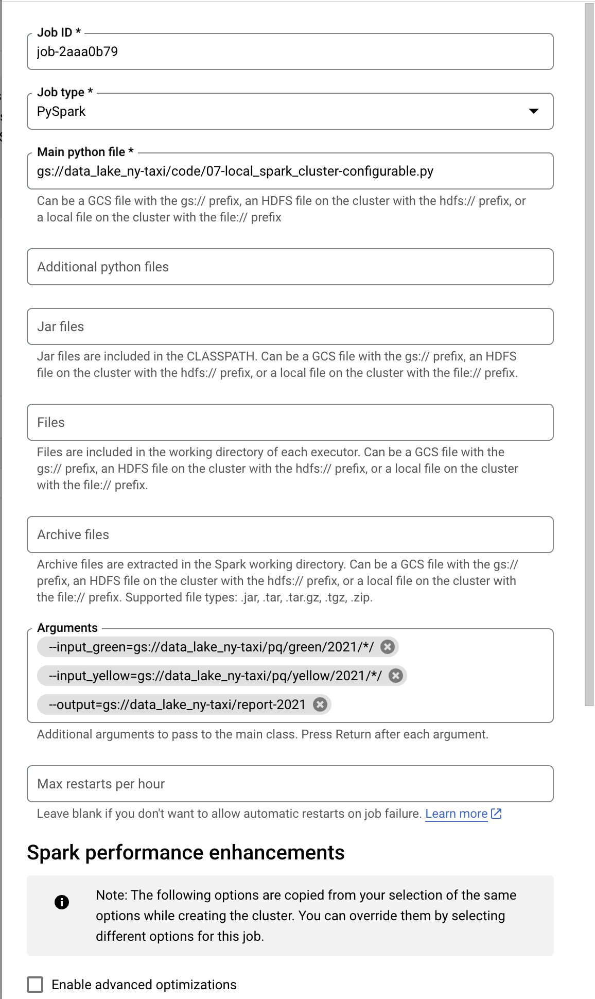

# in progress
# Batch Jobs Using Spark Within Linux GCP VM


## Table of Contents
1. [Project Overview, Objectives, and Key Features](#overview)
2. [Installing Java](#installing-java)
3. [Using PySpark](#using-pyspark)
4. [Spark/PySpark](#sparkpyspark)

## Overview

### Objectives
- placeholder

### Key Features
- placeholder


## Visualization Chart




## Installing Java and Spark
**1. Install Java Using `wget`**
```bash
mkdir spark # make a new directory
cd spark # change directory
wget https://download.java.net/java/GA/jdk11/9/GPL/openjdk-11.0.2_linux-x64_bin.tar.gz # download java
```

**2. Unpack**
- Unpack the file:
```
tar xzfv openjdk-11.0.2_linux-x64_bin.tar.gz
```

**3. Create a Java Variable**
- Create a `JAVA_HOME` variable and add it to the path:
```bash
export JAVA_HOME="${HOME}/spark/jdk-11.0.2" # creating the JAVA_HOME variable to be used in scripts
export PATH="${JAVA_HOME}/bin:${PATH}" # adding JAVA_HOME to the path
```
> ***Note: It's important to name the variable `JAVA_HOME` because it's a widely adopted naming convention across the JDK.***

- Check if it works:
```
java --version
```


**4. Installing Spark Using `wget`**
- 
```bash
wget https://archive.apache.org/dist/spark/spark-3.3.2/spark-3.3.2-bin-hadoop3.tgz # download spark 3.3.2
tar xzfv spark-3.3.2-bin-hadoop3.tgz # unpack the file
```

**5. Add Spark to Path**
```bash
export SPARK_HOME="${HOME}/spark/spark-3.3.2-bin-hadoop3" # creating the SPARK_HOME variable to be used in scripts
export PATH="${SPARK_HOME}/bin:${PATH}" # adding SPARK_HOME to the path
```

**6. Testing Spark**
- Execute `spark-shell` and run the following:
```scala

val data = 1 to 10000
val distData = sc.parallelize(data)
distData.filter(_ < 10).collect()
```


**7. Add Java and Spark to `.bashrc`**
- Add java and spark variables and add them to the path in `.bashrc` to avoid doing it every time when launching the VM

```bash
# shell script that runs when the VM starts
nano .bashrc

# java
export JAVA_HOME="${HOME}/spark/jdk-11.0.2"
export PATH="${JAVA_HOME}/bin:${PATH}"

# spark
export SPARK_HOME="${HOME}/spark/spark-3.3.2-bin-hadoop3"
export PATH="${SPARK_HOME}/bin:${PATH}"
```

- Once completed, run `source .bashrc` which will automatically execute the java and spark configurations everytime


## Using Pyspark

**1. Add PySpark to Path**
- To run PySpark, first it needs to be added to PYTHONPATH:
```bash
export PYTHONPATH="${SPARK_HOME}/python/:$PYTHONPATH"
export PYTHONPATH="${SPARK_HOME}/python/lib/py4j-0.10.9-src.zip:$PYTHONPATH"
```

**2. Make a New Directory**
- Make a new directory and run `jupyter notebook`
```
mkdir notebooks
jupyter notebook
```
**3. Port Forwarding**
- Forward port `8888` in the ports menu on VScode to access Jupyter from the local machine

**4. Initiate Jupyter Instance**
- Once Jupyter is launched, run `import pyspark ` in a new notebook
- If there is a `ModuleNotFoundError: No module named 'py4j'`, run the following in terminal:
```bash
pip install py4j
```

> ***Refer to Jupyter file for remaining steps: [spark_job](02-spark_job.ipynb)***

- Forward port `4040` to access spark GUI


## Spark/PySpark
Interacting with high-volume NYC taxi data and using spark/pyspark for manipulation

**1. Run Jupyter**
- Refer to the steps outlined in this notebook: [pyspark notebook](code/02-pyspark.ipynb)

## Spark DataFrames

**2. Transformations vs Actions**

In spark, there are two distinctions between code that is activated right away and not activated right away,

- Transformations - lazy (not executed immediately)
    - selecting columns
    - filters
    - joins
    - groupbys


- Actions - eager (executed immediately)
    - show 
    - take
    - head
    - write

**3. Functions and UDF's**


## SQL with Spark
Execute the following script to download the required datasets: [download_data.sh](code/download_data.sh)

Example: 
```bash
./download_data.sh yellow 2020 # download yellow taxi data from 2020

./download_data.sh green 2021 # download green taxi data from 2021
```

Remaining steps can be found in the following jupyter notebooks:

1. [Spark and SQL](code/04-spark_sql.ipynb)
2. [Groupby and SQL Joins](code/05-groupby_join.ipynb)


## RDD's


## Running Spark in the Cloud
Uploading `pq` (parquet file subdirectory) to GCS:

```bash
gsutil -m cp -r pq/ gs://dtc_data_lake_de-zoomcamp-nytaxi/pq
```
- `-m` flag enables parallel transfers. Performs multiple upload/download operations concurrently rather than individually. Useful when ingesting a large number of files
- `-r` flag recursively copies the contents of directories. Useful for when there are multiple files and subdirectories needed to be ingested


Make a new `lib` directory and download the following jar file for connecting to GCS to interact with it from Jupyter:

```bash
gsutil cp gs://hadoop-lib/gcs/gcs-connector-hadoop3-2.2.5.jar gcs-connector-hadoop3-2.2.5.jar
```

Remaining steps and configuration can be found in the following notebook: [06_spark_gcs.ipynb](06_spark_gcs.ipynb)


## Local Cluster and Spark-Submit

Creating a stand-alone cluster: ([documentation](https://spark.apache.org/docs/latest/spark-standalone.html)):

```bash
./sbin/start-master.sh
```

Creating a worker to handle executions:

```bash
URL="spark://de-prac.us-central1-a.c.radiant-psyche-403018.internal:7077"

./sbin/start-worker.sh ${URL}

# ./sbin/start-worker.sh spark://de-prac.us-central1-a.c.radiant-psyche-403018.internal:7077
```


Turn the notebook into a script and then run it:

```bash
jupyter nbconvert --to=script 07-local_spark_cluster.ipynb
```

Run the following to initate the script:

```bash
~/spark/spark-3.3.2-bin-hadoop3/bin/spark-submit 07-local_spark_cluster.py
```

If this error is encountered:
```bash
24/03/08 18:10:33 WARN TaskSchedulerImpl: Initial job has not accepted any resources; check your cluster UI to ensure that workers are registered and have sufficient resources
```
it means there is another application is using the cores which must be killed:



Creating a configurable script with arguments using `argparse`:

Script can be found here: [configurable spark script](code/07-local_spark_cluster-configurable.py)

Run the following to download 2020 data and execute the script in a python environment:
```bash 
python 07-local_spark_cluster-configurable.py \
    --input_green=data/pq/green/2020/* \
    --input_yellow=data/pq/yellow/2020/* \
    --output=data/report/spark_script_data/2020
```

Run the following to download 2020 data and execute the script in a spark cluster environment:
```bash
~/spark/spark-3.3.2-bin-hadoop3/bin/spark-submit 07-local_spark_cluster-configurable.py \
    --input_green=data/pq/green/2020/* \
    --input_yellow=data/pq/yellow/2020/* \
    --output=data/report/spark_script_data/2020
```

Run the folling to download 2021 data and execute the script using `spark-submit` with `--master` flag:
```bash
URL="spark://de-prac.us-central1-a.c.radiant-psyche-403018.internal:7077"

spark-submit \
    --master="${URL}" \
    07-local_spark_cluster-configurable.py \
        --input_green=data/pq/green/2021/*/ \
        --input_yellow=data/pq/yellow/2021/*/ \
        --output=data/report/spark_script_data/2021
```


### Data Proc

- Navigate to the cloud console and search "dataproc" in the search bar.
- Select `compute engine` dataproc and complete the required configurations
- Once completed, navigate to the cluster and click `submit job`

> Note: When using `dataprocs`, there is no need for manual configurations as was done here locally: [spark_gcs](06-spark_gcs.ipynb). All the configurations are already taken care of.

Copy [07-local_spark_cluster-configurable.py](07-local_spark_cluster-configurable.py) script to gcs data lake

```bash
gsutil cp 07-local_spark_cluster-configurable.py gs://data_lake_ny-taxi/code/07-local_spark_cluster-configurable.py
```

Upload the script to GCS:

Arguments to be specified for the job:
```bash
--input_green=gs://data_lake_ny-taxi/pq/green/2021/*/ \
--input_yellow=gs://data_lake_ny-taxi/pq/yellow/2021/*/ \
--output=gs://data_lake_ny-taxi/report-2021
```


click submit and the data should successfully transfer to the datalake

Using Google Cloud SDK for submitting to dataproc
([link](https://cloud.google.com/dataproc/docs/guides/submit-job#dataproc-submit-job-gcloud))

```bash
gcloud dataproc jobs submit pyspark \
    --cluster=de-cluster \
    --region=us-central1 \
    gs://data_lake_ny-taxi/code/07-local_spark_cluster-configurable.py \
    -- \
        --input_green=gs://data_lake_ny-taxi/pq/green/2020/*/ \
        --input_yellow=gs://data_lake_ny-taxi/pq/yellow/2020/*/ \
        --output=gs://data_lake_ny-taxi/report-2020
```

`--` sign after the configuration means that the config is done and the proceeding lines are arguments


## Big Query

Upload the updated `.py` script to GCS:
[07-local_spark_cluster-bigquery.py](07-local_spark_cluster-bigquery.py)

```bash
gsutil cp 07-local_spark_cluster-bigquery.py gs://data_lake_ny-taxi/code/07-local_spark_cluster-bigquery.py
```

Write results to big query ([BigQuery connector docs](https://cloud.google.com/dataproc/docs/tutorials/bigquery-connector-spark-example#pyspark)):

```bash
gcloud dataproc jobs submit pyspark \
    --cluster=de-cluster \
    --region=us-central1 \
    --jars=gs://spark-lib/bigquery/spark-bigquery-latest_2.12.jar \
    gs://data_lake_ny-taxi/code/07-local_spark_cluster-bigquery.py \
    -- \
        --input_green=gs://data_lake_ny-taxi/pq/green/2020/*/ \
        --input_yellow=gs://data_lake_ny-taxi/pq/yellow/2020/*/ \
        --output=trips_data_all.reports-2020
```
