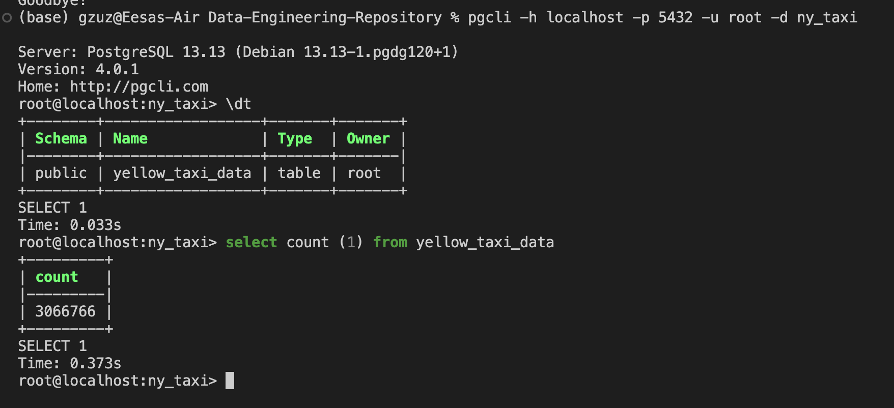
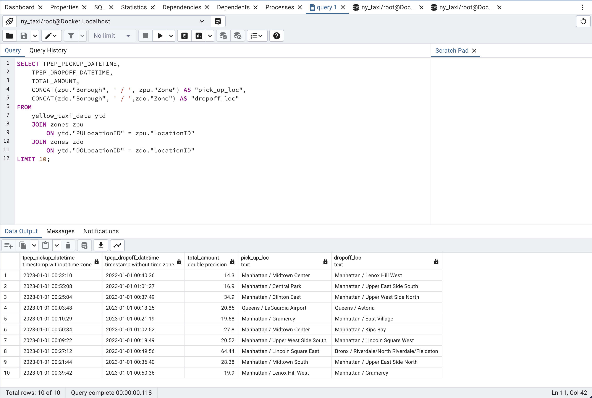
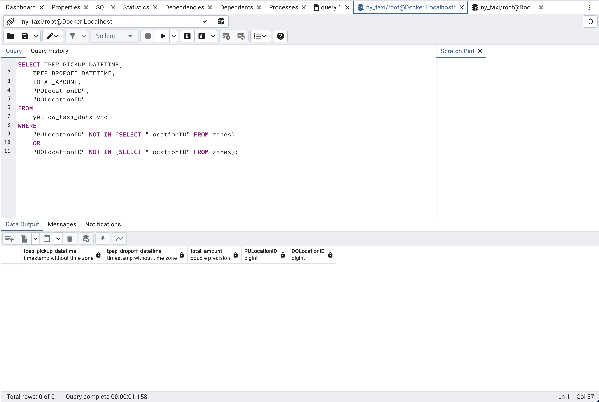
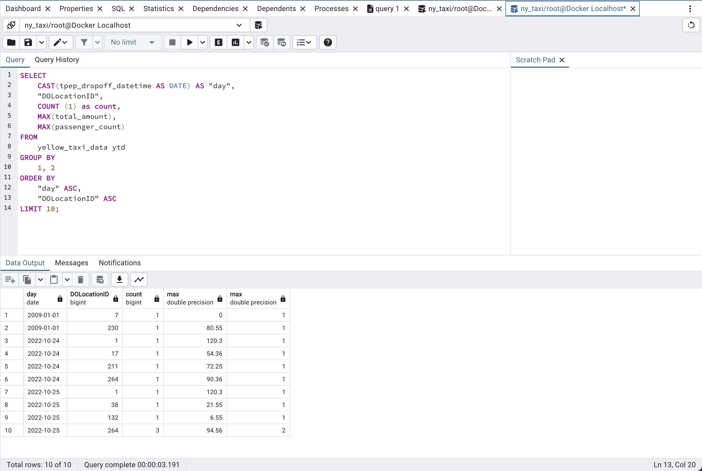

# Setting up a PostgreSQL Database in Docker for Ingesting data and Data Analysis

## This project outlines the process for setting up a PostgreSQL database in a Docker container and ingesting data for analysis.

### Prerequisites
- Docker installed and running
- Basic knowledge of command-line interfaces, Docker commands, and pandas

## Running a PostgreSQL Docker Container

Run the following command in cli to start a PostgreSQL container:
```bash
docker run -d \
-e POSTGRES_USER="root" \
-e POSTGRES_PASSWORD="root" \
-e POSTGRES_DB="ny_taxi" \
-v $(pwd)/ny_taxi_postgres_data:/var/lib/postgresql/data \
-p 5432:5432 \
postgres:13
```
- `docker run -d` runs the container in the background allowing you to still use the command interface
- For an interactive session, replace `-d` with `-it`
```
docker run -it
```

## Connecting to the PostgreSQL Database using `pgcli`

Istall pgcli for a command-line interface experience:
- In a terminal:
```bash
pip install pgcli
```
- In python or jupyter environment, use:
```bash
!pip install pgcli
```
Follow the steps outlined in this notebook to batch transfer the data into the PostgresSQL database:
[data-upload-to-postgres](data-upload-to-postgres.ipynb)

**Data Source:**
> https://www.nyc.gov/site/tlc/about/tlc-trip-record-data.page

- Select January 2023 dropdown > (2023 January, "Yellow Taxi Trip Records")
- Or directly download the file using the this link:
> https://d37ci6vzurychx.cloudfront.net/trip-data/yellow_tripdata_2023-01.parquet


Run this command to connect to the PostgreSQL database:
```bash
pgcli -h localhost -p 5432 -u root -d ny_taxi 
```


## Running pgAdmin in a Docker Container

To manage the PostgreSQL database through a web interface, start pgAdmin using this command:
```bash
docker run -d \
-e PGADMIN_DEFAULT_EMAIL="admin@admin.com" \
-e PGADMIN_DEFAULT_PASSWORD="root" \
-p 8080:80 \
dpage/pgadmin4
```
- Access pgAdmin by navigating to "localhost:8080" in a web browser and log in using the specified credentials above


## Docker Networking

Create a Docker network to facilitate communication between PostgreSQL database and pgAdmin:
```bash
docker network create pg-network
```

## Connecting PostgreSQL and pgAdmin on the Same Network

Reconfigure both services to add them to the network

PostgreSQL Database with Network Configuration:
```bash
docker run -it \
-e POSTGRES_USER="root" \
-e POSTGRES_PASSWORD="root" \
-e POSTGRES_DB="ny_taxi" \
-v $(pwd)/ny_taxi_postgres_data:/var/lib/postgresql/data \
-p 5432:5432 \
--network=pg-network \
--name pg-database \
postgres:13
```

pgAdmin with Network Configuration:
```bash
docker run -it \
-e PGADMIN_DEFAULT_EMAIL="admin@admin.com" \
-e PGADMIN_DEFAULT_PASSWORD="root" \
-p 8080:80 \
--network=pg-network \
--name pgadmin \
dpage/pgadmin4
```
- Container naming (--name) helps in identifying and managing containers, especially when handling multiple instances


## Alternative method to interact with the PostgreSQL database can be found here: [jupyter-to-postgres-connection.ipynb](jupyter-to-postgres-connection.ipynb)


## Convert a Jupyter Notebook to a Script to Run in cli
```bash
jupyter nbconvert --to=script data-upload-to-postgres.ipynb
```

## Automating Data Ingestion
The [automating-data-ingestion](automating-data-ingestion.py) script demonstrates an automated data ingestion process
```bash
python automating-data-ingestion.py \
  --user=root \
  --password=root \
  --host=localhost \
  --port=5432 \
  --db=ny_taxi \
  --table_name=yellow_taxi_data \
  --url=${URL}
```

## Dockerizing the Data Ingestion Script
To dockerize the data ingestion script, a Dockerfile is used to define the environment, dependencies, and the script execution. 

The original Dockerfile without comments can be found here [Dockerfile](Dockerfile)

```Dockerfile
FROM python:3.11.4 
"
This line sets the base image for the Docker container. 
Here, it's using the official Python Docker image tagged with 3.11.4, 
which means this container will have Python version 3.11.4 installed.
"

RUN pip install pandas sqlalchemy psycopg2 pyarrow requests
"
This command runs pip install inside the container, which is Python's package installer. 
It's used to install several Python libraries:

pandas: A data manipulation and analysis library.
sqlalchemy: A SQL toolkit and Object-Relational Mapping (ORM) library.
psycopg2: A PostgreSQL database adapter for Python.
pyarrow: Provides Python bindings to the Apache Arrow data format.
requests: A library for making HTTP requests.
"

WORKDIR /app 
"
This instruction sets the working directory in the container to "/app". 
All subsequent commands will be run from this directory. 
If the directory does not exist, it will be created.
"

COPY automating-data-ingestion.py automating-data-ingestion.py
"
This line copies the automating-data-ingestion.py file from the local machine into the container. 
The file is placed in the containers working directory "/app", as set by the previous WORKDIR instruction).
"

ENTRYPOINT [ "python", "automating-data-ingestion.py"]
"
Specifies the command to be executed when the container starts. 
In this case, it's executing the Python script "automating-data-ingestion.py" with Python. 
Essentially, when the container starts, it will run "python" and the script "automating-data-ingestion.py"
"
```

Run the following command to build the Docker image based on the Dockerfile just created:
```bash
docker build -t taxi_ingest:v001 .
```
- The "." signifies the current directory, indicating where Docker should look for the Dockerfile

## Executing the Data Ingestion Container
First, set the URL in your command line:
```bash
URL="https://d37ci6vzurychx.cloudfront.net/trip-data/yellow_tripdata_2023-01.parquet"
```
Then, run the Docker container:
```bash
docker run -it \
  --network=pg-network \
  taxi_ingest:v001 \
    --user=root \
    --password=root \
    --host=pg-database \
    --port=5432 \
    --db=ny_taxi \
    --table_name=yellow_taxi_data \
    --url=${URL}
```

## Finally, bringing it all together with Docker compose
Docker Compose YAML files provide an efficient, and standardized way to define, configure, and manage all the components of multi-container Docker applications. 

The original file without comments can be found here: [docker-compose.yaml](docker-compose.yaml)

```Dockerfile
services: "defines the different containers (services) that make up the  application"
 pgdatabase: "service (container) to be configurated"
   image: postgres:13 "Docker image for PostgreSQL version 13"
   environment: "defines environment variables for the container"
     - POSTGRES_USER=root "sets the default user for the PostgreSQL database to 'root'"
     - POSTGRES_PASSWORD=root "sets the default password for the PostgreSQL database to 'root'"
     - POSTGRES_DB=ny_taxi "creates a default database named 'ny_taxi'."
   volumes: "maps a local directory (right of the colon) to the data directory inside the container (left of the colon)"
    - ./data/ny_taxi_postgres_data:/var/lib/postgresql/data:rw "'rw' specifies that both read and write operations are allowed on this volume"
   ports: "maps port 5432 of the container (PostgreSQL's default port) to port 5432 on the host machine."
    - "5432:5432" 
 pgadmin: "the next service (container) to be configurated"
   image: dpage/pgadmin4 # official pgAdmin 4 image
   environment:
     - PGADMIN_DEFAULT_EMAIL=admin@admin.com
     - PGADMIN_DEFAULT_PASSWORD=root
   ports:
    - "8080:80"
```

## SQL Queries
After running the Docker compose file and all the environmental variables and dependencies are set up, all that's left is to begin analyzing the data. 

Sample queries:




