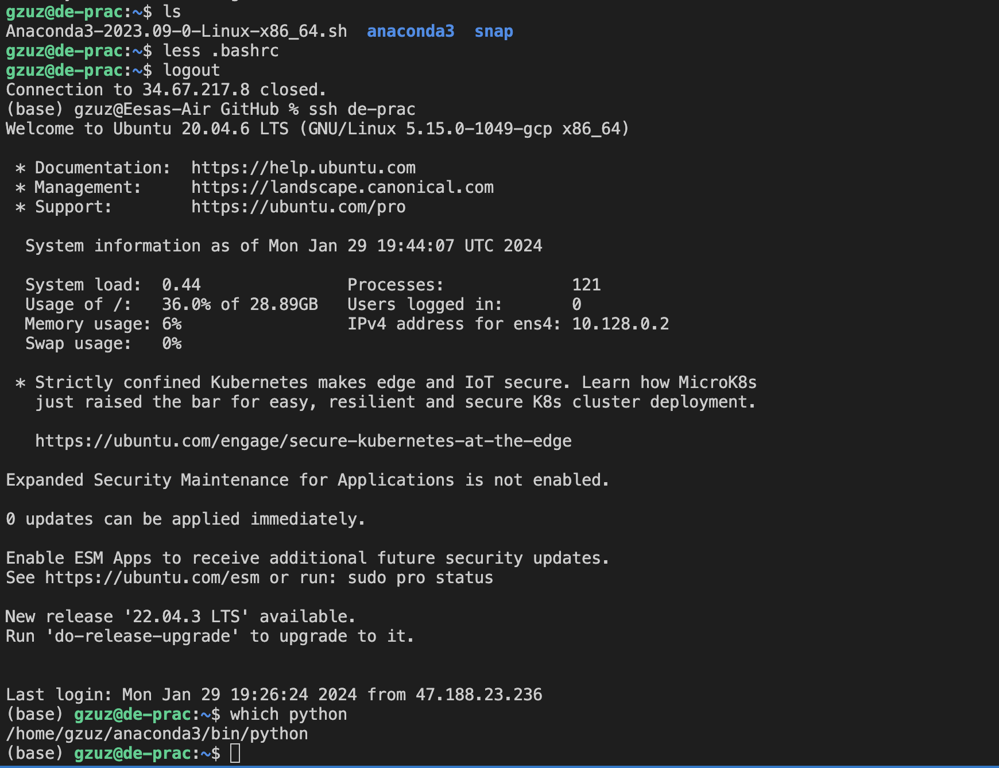
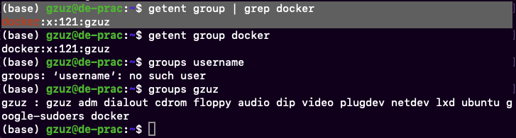

# Setting Up a Cloud Environment With GCP, Docker, and Terraform
This project serves as a personal guide and reminder for setting up and managing cloud infrastructure, VM instances, Docker containers, and using Terraform for infrastructure automation all done through a virtual environment using GCP's virtual machine. 


## Setting up SSH Access
**Ensures secure and easy access to the virtual machines and containers:**

1. Create an .ssh/ directory
    - create a dedicated directory for SSH keys: `mkdir ~/.ssh`

2. Generate an ssh key with the following command:
```bash
ssh-keygen -t rsa -f ~/.ssh/KEY_FILENAME -C USERNAME -b 2048
```
> https://cloud.google.com/compute/docs/connect/create-ssh-keys

- Example:
```
ssh-keygen -t rsa -f gcp -C gzuz -b 2048
```
> ***Note: there are two keys, ".pub" key can be shared, but the other must be kept private.***

3. Add SSH Key to GCP:
    - In the GCP console, navigate to Compute Engine > Settings. Add the public SSH key under Metadata.
    - Use cat `~/.ssh/gcp.pub` to display the key and copy its contents into the SSH key field in the GCP Console.

## Creating and Accessing a VM Instance
1. Creating a VM instance:
- Navigate to the Virtual Machines menu under Compute Engine in GCP and create an instance with the desired specifications.
    1. Changed name
    2. Changed region
    3. Change machine type to e2-standard-4 (4vCPU, 16 GB memory)
    4. Selected Ubuntu 20.04 LTS image and 30 GB boot disk
> ***Or refer to the [GCP configuration terraform file](main.tf)***
2. SSH Connection:
    - Once the setup is complete, copy the external IP of the VM.
    - Connect to the VM using SSH with the generated key:
```bash
ssh -i file-name username@ip                                               
```
> ***The command `ssh -i file-name username@ip` is used in Unix-like systems to securely connect to a remote server using SSH (secure shell). The `-i` option specifies a private key for authentication, `username` is the user on the remote server, and `ip` is the server's IP address or hostname.***
- Example:
```bash
ssh -i gcp gzuz@34.67.217.8                                               
```


## Installing Anaconda and Docker
Set up Anaconda for a data science/analytics environment and Docker for container management

- Install Anaconda:
``` bash
wget https://repo.anaconda.com/archive/Anaconda3-2023.09-0-Linux-x86_64.sh
bash Anaconda3-2023.09-0-Linux-x86_64.sh 
```
Follow the installation prompts, and then either log out and back in or run `source .bashrc` to apply changes.

**To verify if it worked, "(base)" will show before the username:**



- Install Docker
Update the package list and install Docker:
```bash
sudo apt-get update # updates the list of packages
sudo apt-get install docker.io
```


## Simplifying Access with a `config` File
Creating a [config](.ssh/config) file will make it easier and quicker to access the environment:
```bash
Host de-prac
    HostName 34.67.217.8
    User gzuz
    IdentityFile ~/.ssh/gcp # must be in home directory for it to work
```


## Using VScode with Remote SSH
Leveraging VSCode for remote development:
1. Download remote SSH extension in VSCode.
2. Connect to the host (your VM) using the configured SSH settings for streamlined code management and development.
> ***Since the config file is already created, the name for the vm will show up***
3. Clone the repository:
```
git clone https://github.com/eesahasan1/Data-Engineering-Repository.git
```


## Using Docker Without `sudo` in VM Instance
Configure Docker to run without `sudo` for every command:
1. Create a Docker group and add user:
```
sudo groupadd docker
sudo gpasswd -a $USER docker
```
Example:
```
sudo gpasswd -a $gzuz docker
```
2. Restart the Docker service to apply these changes:
```
sudo service docker restart
```
3. Verify these changes:



## Downloading and Setting Up Docker Compose
Install Docker Compose for multi-container Docker applications management:
1. Make a `bin` directory to store the docker compose file
```bash
mkdir ~/bin
cd ~/bin
wget https://github.com/docker/compose/releases/download/v2.24.3/docker-compose-linux-x86_64 -O docker-compose
```
2. Make executable and verify:
    - Grant execution rights and check the installed version:
```bash
chmod +x docker-compose
./docker-compose version
```

**OPTIONAL**\
- Add ~/bin to PATH for easy access to executables. Run `nano .bashrc` from home directory and add the following:
```
export PATH="${HOME}/bin:${PATH}" 
```
> ***The `.bashrc` file is a script that runs every time a new terminal session is started in interactive mode using the Bash shell. It's one of the startup files used to configure a user's shell environment. `.bashrc` stands for "Bash run commands."***


## Handling Docker Permission Error
When encountering permission issues/error after trying to run `docker-compose up -d`, adjust permission or add user to the Docker group for a safer resolution:

- Run this command for a quick fix (note that it may introduce security risks):
```bash
sudo chmod 666 /var/run/docker.sock
```
> This command changs file permissions:\
**chmod** = change mode | 
**666** = owner, group, others
>
> Permissions are represented as a three-digit numbers, where each digit can be a number from 0 to 7.
Each digit represents the permissions for different user classes:
>  - The first digit is for the owner of the file.
>  - The second digit is for the group associated with the file.
>  - The third digit is for others (everyone else).
>       - 4 always represents Read permission.
>       - 2 always represents Write permission.
>       - 1 always represents Execute permission.
>        - Read (4) + Write (2) = 6: Grants read and write permissions.
>       - Read (4) + Execute (1) = 5: Grants read and execute permissions.
>       - Read (4) + Write (2) + Execute (1) = 7: Grants read, write, and execute permissions

**For a safer fix:**
```bash
sudo usermod -aG docker $USER
newgrp docker
sudo service docker restart
```
> - `sudo usermod -aG docker $USER` adds the current user to the 'docker' group, granting them permission to run Docker commands without needing sudo.
> - `newgrp docker` switches the current session to use the 'docker' group, applying the new group membership immediately.
> - `sudo service docker restart` restarts the Docker service to ensure all changes take effect, including updating permissions and group memberships.

Example:
```bash
sudo usermod -aG docker $gzuz
```


## Installing and Using pgcli for Database Access In Terminal
`pgcli` is a command-line interface for Postgres

- Install pgcli using pip:

```bash
pip install pgcli
# or use conda if above does not work
conda install -c conda-forge pgcli
```

To access the database, run:

```bash
pgcli -h localhost -U root -d ny_taxi
```
- "-h" localhost specifies the host.
- "-U" root is the username for the database
- "-d" ny_taxi is the name of the database you are accessing.

To view running Docker containers enter `docker ps` or all containers `docker ps -a`


## Accessing Containerized pgAdmin Web Interface in the VM
1. Copy port information:
   - From the VM terminal, run `docker ps` and copy the port information of the container to be accessed.
2. Configure SSH in VSCode:
   - Open SSH interface in VSCode.
   - Paste the copied port information in the ports menu
3. Access via local machine:
   - Enter localhost:8080 in the local machines web browser to access the pgAdmin web interface.
4. Database Access
   - The database can also be accessed from the local machine's terminal using `pgcli -h localhost -U root -d ny_taxi`.

](data/images/image3.png)


## Running Jupyter Notebook in the VM for Data Ingestion
To use Jupyter Notebook hosted on the VM:

1. Run Jupyter Notebook:
   - In the VM terminal, run jupyter notebook.
   - Copy the provided link to access the Jupyter interface.
2. Add Port in VSCode:
   - Before using the link, add the port (typically 8888) in the SSH VSCode port menu.
3. Access Jupyter Interface:
   - Paste the Jupyter link into your web browser.
   - If a token is required, retrieve it with:
```
jupyter notebook list
```
- Example:
```
(base) gzuz@de-prac:~$ jupyter notebook list
Currently running servers:
http://localhost:8888/?token=094c20195b0cede1f232af980963c1fc77e93d16fe0973f8 :: /home/gzuz/Data-Engineering-Repository/docker_sql
```
> **Token: token=094c20195b0cede1f232af980963c1fc77e93d16fe0973f8**
4. Installing `psycopg2-binary`:
    - If there is a `ModuleNotFoundError: No module named 'psycopg2'` error when trying to connect to the engine, install the following:
```
pip install psycopg2-binary
```
**After installation, rerun the notebook.**


## Installing terraform
There are two methods to install Terraform:
1. Direct download:
```bash
wget https://releases.hashicorp.com/terraform/1.7.1/terraform_1.7.1_linux_amd64.zip
```

2. Using a package manager (apt):\
When running it this way, `apt` (package manager) automatically places executable files in its standard location (system directory, not user directory) such as `/usr/bin` regardless of the current directory
```bash
 wget -O- https://apt.releases.hashicorp.com/gpg | sudo gpg --dearmor -o /usr/share/keyrings/hashicorp-archive-keyring.gpg
 echo "deb [signed-by=/usr/share/keyrings/hashicorp-archive-keyring.gpg] https://apt.releases.hashicorp.com $(lsb_release -cs) main" | sudo tee /etc/apt/sources.list.d/hashicorp.list
 sudo apt update && sudo apt install terraform
```


## Configuring Google Cloud
To set up Google Cloud in the VM:
1. Transfer SSH key via sftp: 
    - Securely transfer your GCP service account key to the VM using `sftp`.
- Example:
```bash
sftp de-prac
mkdir .gc
put my-creds.json
```
2. Set environment variable and activate the account:
    - Set the `GOOGLE_APPLICATION_CREDENTIALS` environment variable to the path of the transferred key, and activate the service account.
- Example:
```
export GOOGLE_APPLICATION_CREDENTIALS=~/.gc/my-creds.json

gcloud auth activate-service-account --key-file $GOOGLE_APPLICATION_CREDENTIALS
```


## Using Terraform
Automate infrastructure deployment with Terraform:
1. terraform init:
    - Initializes terraform
2. terraform plan:
    - Make sure the location for the SSH JSON key is correct
```
variable "credentials" {
  description = "My credentials"
  default     = "~/.gc/my-creds.json"
}
```
3. terraform apply
    - Final step to apply confifurates for infrastucture management


## Shutdown and Restarting
- Use `sudo shutdown now` to stop the VM instance
- When starting the VM instance again, copy the new external IP and replace the old one in the SSH config file from the host machine. 
```
nano .ssh/config
```