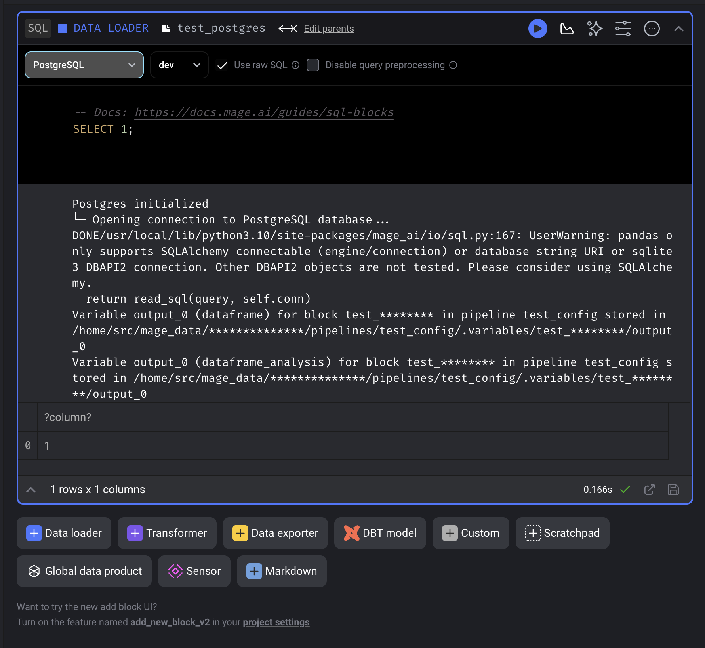
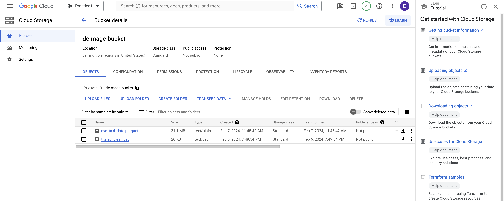
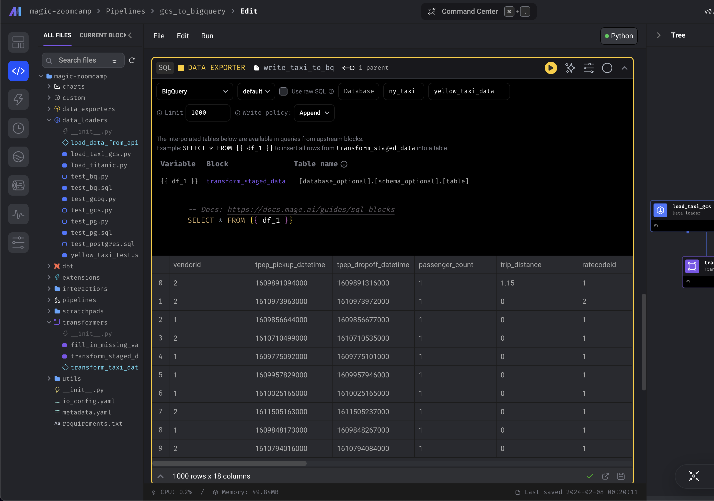
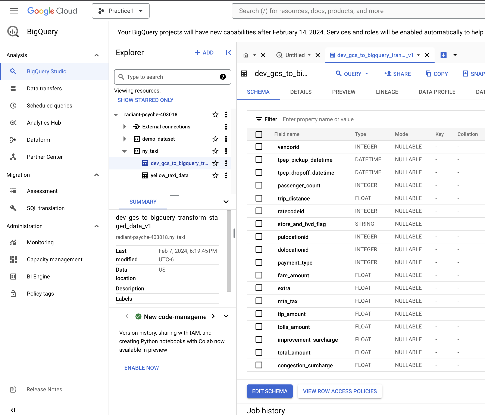
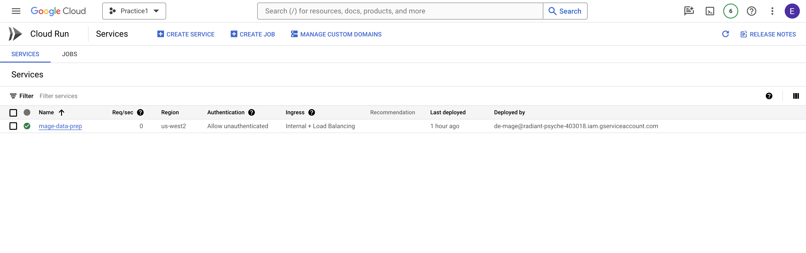
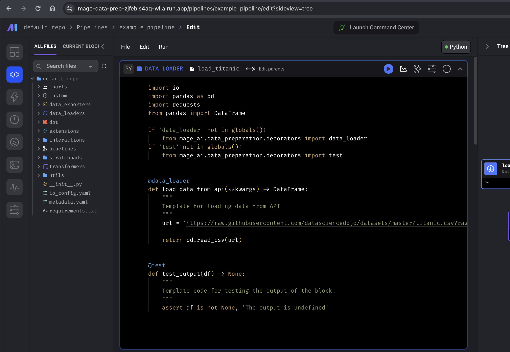

# Building Data a Pipeline with Mage


## Table of Contents

1. [Project Overview, Objectives, and Key Features](#overview)
2. [Configuring Mage](#configuring-mage)
3. [Configuring Postgres in Mage](#configuring-postgres-in-mage)
4. [ETL: API to Postgres](#etl-api-to-postgres)
5. [Configure a GCP Bucket with Mage](#congigure-a-gcp-bucket-with-mage)
6. [ETL: API to GCS](#etl-api-to-gcs)
5. [ETL: GCS to BigQuery](#etl-gcs-to-bigquery)
6. [Deploying Mage to Google Cloud](#deploying-mage-to-google-cloud)


## Overview

This project focuses on constructing a robust data pipeline using Mage, a powerful tool designed to streamline and automate the process of data extraction, transformation, and loading (ETL). By leveraging Mage's intuitive interface and extensive functionality, it efficiently process large datasets, transform them according to business requirements, and load the refined data into various storage solutions for further analysis and decision-making.

### Objectives

- **Data Extraction:** Automate the extraction of data from diverse sources, including APIs and cloud storage solutions like Google Cloud Storage (GCS).
- **Data Transformation:** Implement transformation logic to clean, aggregate, and modify the data, ensuring it meets the necessary quality standards for analysis.
- **Data Loading:** Load the transformed data into PostgreSQL and BigQuery, facilitating easy access and analysis by downstream applications and stakeholders.

### Key Features

- **Configurable ETL Pipelines:** Utilize Mage to create flexible and configurable ETL pipelines that can be easily adjusted to meet evolving data processing needs.
- **Cloud Integration:** Seamlessly integrate with cloud services such as GCS and BigQuery, enabling efficient data storage and analysis in a scalable cloud environment.
- **Data Quality Assurance:** Implement data validation and cleaning steps within the pipeline to ensure high data quality and reliability.


## Configuring Mage
**1. Clone the Repository**

```
git clone https://github.com/mage-ai/mage-zoomcamp.git
```

- Use `ls -la` to view hidden files, including files that start with ".".

**2. Prepare Environmental Variables**
- Before any Docker or Docker Compose commands, run:
```
cp dev.env .env
```
- The .env file contains environment variables for the project.
    
    >**Important:** It's necessary to copy this file because it's ignored by git and needed to inject variables into certain parameters. This approach minimizes the risk of accidentally committing files with potential security risks.

**3. Building the Docker Image**
- Build the image before running it to ensure the container runs with the latest code and dependencies:
```bash
docker compose build
```

**4. Updating the Docker Image**
- The image might be missing updates. Run the following command to update it to the latest version:
```bash
docker pull mageai/mageai:latest
```

**5. Start the Containers**
- Now that the image is updated, run the following command to start the containers:
```
docker compose up
```
- Enter localhost:6789 in a web browser to access Mage GUI.


## Configuring Postgres in Mage
**1. Modify the Configuration File**
- In the configuration file "io_config.yaml," add the following profile for PostgreSQL:

```yaml
dev:
  POSTGRES_CONNECT_TIMEOUT: 10
  POSTGRES_DBNAME: "{{env_var('POSTGRES_DBNAME')}}"
  POSTGRES_SCHEMA: "{{env_var('POSTGRES_SCHEMA')}}"
  POSTGRES_USER: "{{env_var('POSTGRES_USER')}}"
  POSTGRES_PASSWORD: "{{env_var('POSTGRES_PASSWORD')}}"
  POSTGRES_HOST: "{{env_var('POSTGRES_HOST')}}"
  POSTGRES_PORT: "{{env_var('POSTGRES_PORT')}}"
```

**2. Create a New SQL Data Loader Block**
- Select `PostgresSQL` connection and `dev` for profile.
- Ensure the connection works by running:

```sql
select 1;
```



## ETL: API to Postgres
Loading data from an API to PostgreSQL

**1. Create a New Standard Pipeline**
- With a data loader block, select Python for language and API for template.
- Paste the following URL in the URL parameter in Mage:
    > https://github.com/DataTalksClub/nyc-tlc-data/releases/download/yellow/yellow_tripdata_2021-01.csv.gz

```python
@data_loader
def load_data_from_api(*args, **kwargs):
    """
    Template for loading data from API
    """
    url = 'https://github.com/DataTalksClub/nyc-tlc-data/releases/download/yellow/yellow_tripdata_2021-01.csv.gz'
```

**2. Remove Unnecessary Code**
- The following code is not needed for CSV files and can be removed:
```python
    response = requests.get(url)

    return pd.read_csv(io.StringIO(response.text), sep=',')
```

**3. Data Types**
- Optimize memory usage by setting explicit data types and parsing dates:
```python
# Define a dictionary mapping column names to their data types.
# This ensures each column is read with the specified type, improving memory usage and data integrity.
taxi_dtypes = {
    'VendorID': pd.Int64Dtype(), # Integer data type
    'passenger_count': pd.Int64Dtype(),
    'trip_distance': float, # Floating-point
    'RatecodeID': pd.Int64Dtype(),
    'store_and_fwd_flag': str, # String data type
    'PULocationID': pd.Int64Dtype(),
    'DOLocationID': pd.Int64Dtype(),
    'payment_type': pd.Int64Dtype(),
    'fare_amount': float,
    'extra': float,
    'mta_tax': float,
    'tip_amount': float,
    'tolls_amount': float,
    'improvement_surcharge': float,
    'total_amount': float,
    'congestion_surcharge': float
}

# List of column names that should be parsed as dates.
parse_dates = ['tpep_pickup_datetime', 'tpep_dropoff_datetime']

# Read the CSV file from the given URL.
# - `sep=','` specifies that the separator between columns is a comma.
# - `compression='gzip'` indicates the file is compressed with gzip and needs to be decompressed.
# - `dtype=taxi_dtypes` applies the data types defined in the taxi_dtypes dictionary to the corresponding columns.
# - `parse_dates=parse_dates` tells pandas to automatically parse the columns in the list as datetime objects.
return pd.read_csv(
    url, sep=',', compression='gzip', dtype=taxi_dtypes, parse_dates=parse_dates
)
```
- Pandas can do it on its own but this helps with memory management.

**4. Create a Transform Block**
- Address incorrect data, such as rides with 0 passengers:
```python
# Decorator indicating this function is used for transforming data.
@transformer
def transform(data, *args, **kwargs):
    # Print the number of rides where the passenger count is zero.
    # This uses pandas' .isin([0]) to filter those rows, and .sum() to count them.
    print('Rides with zero passengers:', data.passenger_count.isin([0]).sum())

    # Return a new DataFrame excluding rides with zero passengers.
    # This filters the DataFrame to only include rows where passenger_count > 0.
    return data[data.passenger_count > 0]

# Decorator indicating this function is a test to validate the output of the transformation.
@test
def test_output(output, *args) -> None:
    # Assert that there are no rides with zero passengers in the output DataFrame.
    # If any are found, the assertion fails and raises the specified error message.
    assert output.passenger_count.isin([0]).sum() == 0, 'There are rides with zero passengers'
```

**5. Create a Data Exporter Block**
- Ingest the transformed data into PostgreSQL:

```python
@data_exporter
def export_data_to_postgres(df: DataFrame, **kwargs) -> None:
   
    schema_name = 'ny_taxi_data'  # Specify the name of the schema to export data to
    table_name = 'yellow_taxi_data'  # Specify the name of the table to export data to
    config_path = path.join(get_repo_path(), 'io_config.yaml')
    config_profile = 'dev' # Select the profile that was coinfigured earlier

    with Postgres.with_config(ConfigFileLoader(config_path, config_profile)) as loader:
        loader.export(
            df,
            schema_name,
            table_name,
            index=False,  # Specifies whether to include index in exported table
            if_exists='replace',  # Specify resolution policy if table name already exists
        )

```

**6. Verify Data Ingestion**
- Confirm data ingestion with a SQL data loader block:
```sql
select * from ny_taxi_data.yellow_taxi_data limit 10
```


## Congigure a GCP Bucket with Mage
**1. Create a GCS Bucket**
- Navigate to Google Cloud Storage and create a new bucket.

**2. Service Account and JSON Key**
- Create a new service account in the IAM & Admin section.
- Generate and download a JSON key for this account.


**3. Save JSON Key**
- Store the JSON key in a secure location on local machine.

**4. Update Mage Configuration**
- In Mage GUI, navigate to `io_config.yaml`.
- Add the path to your JSON key in the `GOOGLE_SERVICE_ACC_KEY_FILEPATH` parameter.

**5. Test connection**
- Initiate a new pipeline in Mage.
- Create an SQL data loader block and execute:

```sql
select 1;
```
- A successful query indicates a proper connection setup.

**6. Upload Data File**
- Upload the `titanic_clean.csv` file to your GCS bucket.

**7. Data Loader Block Setup**
- Create a new data loader block with Python and the GCS template.
- Configure the block with the following parameters:

```python
def load_from_google_cloud_storage(*args, **kwargs):
    
    config_path = path.join(get_repo_path(), 'io_config.yaml')
    config_profile = 'dev' # profile

    bucket_name = 'de-mage-bucket' # bucket name
    object_key = 'titanic_clean.csv' # object name or data source

    return GoogleCloudStorage.with_config(ConfigFileLoader(config_path, config_profile)).load(
        bucket_name,
        object_key,
    )
```
- Execute the block to load data from GCS.


## ETL: API to GCS
Process of ingesting data into a GCS bucket configured earlier with Mage AI.

**1. Standard Pipeline Creation**
- Utilize previous pipelines for Postgres for data loader and transformer through drag and drop.

**2. Data Exporter Block**
- Implement a new data exporter block with Python and the GCS template.
- Ensure correct configurations like bucket name and object are set, then run.



**3. Partitioning Datasets**
- For large datasets, partitioning can enhance speed and memory management.
- Implement a Python data loader without a template and connect it to the transformer block.
- Partition data by date using the following script:

```python
# Import necessary libraries from PyArrow for data manipulation and Parquet file operations.
import pyarrow as pa
import pyarrow.parquet as pq
import os

# Check if the 'data_exporter' decorator has already been imported; if not, import it.
# This decorator is used to mark the function as a data exporter in the Mage AI platform.
if 'data_exporter' not in globals():
    from mage_ai.data_preparation.decorators import data_exporter

# Set an environment variable to specify the location of the Google Cloud credentials JSON file.
# This is necessary for authentication when accessing Google Cloud Storage.
os.environ['GOOGLE_APPLICATION_CREDENTIALS'] = '/home/src/radiant-psyche-403018-b12ba5e82eb0.json'

# Define variables for the bucket name, project ID, and the table name for the data to be exported.
bucket_name = 'de-mage-bucket'
project_id = 'radiant-psyche-403018'
table_name = 'nyc_taxi_data'

# Construct the root path in the GCS bucket where the data will be stored.
root_path = f'{bucket_name}/{table_name}'

# Decorate the function with '@data_exporter' to indicate it's used for exporting data.
@data_exporter
def export_data(data, *args, **kwargs):
    # Add a new column to the DataFrame that extracts the date from the 'tpep_pickup_datetime' column.
    data['tpep_pickup_date'] = data['tpep_pickup_datetime'].dt.date

    # Convert the pandas DataFrame to a PyArrow Table. This format is required for Parquet operations.
    table = pa.Table.from_pandas(data)

    # Initialize the Google Cloud Storage filesystem interface.
    gcs = pa.fs.GcsFileSystem()

    # Write the data to a Parquet dataset, partitioning it by the 'tpep_pickup_date' column.
    # This allows for efficient storage and querying of the data based on pickup date.
    pq.write_to_dataset(
        table,
        root_path=root_path,
        partition_cols=['tpep_pickup_date'],
        filesystem=gcs
    )
```


## ETL: GCS to BigQuery
Migrate data from GCS to BigQuery for processing and storage.

**1. Batch Pipeline Creation**
- In Mage, initiate a new batch pipeline.
- Set up a data loader block with Python and GCS template.

**2. SQL Data Exporter Block**
- Configure a SQL data exporter block.
- Input `ny_taxi` for schema and `yellow_taxi_data` for the table.
- Run the query:
    - Running this query essentially ingests the data into bigquery.





## Deploying Mage to Google Cloud
**1. Permissions Setup**
- Assign owner permissions to the service account for full access. Adjust permissions based on real-world needs to minimize user accessibility and security risks.

**2. gcloud CLI Installation**
- Follow the installation guide:
    > https://cloud.google.com/sdk/docs/install

**3. Terraform Template Repo Cloning**- clone the following repo to access terraform templates for the required cloud provider
    > https://github.com/mage-ai/mage-ai-terraform-templates

**4. VSCode Setup**
- Change to the cloned directory and open in VSCode:
```
code .
```
- If `code` is not recognized, install it via VSCode's command palette.

**5. Terraform Configuration**
- Update main.tf and variables.tf with necessary configurations.
- Add the following variables to main.tf:

```bash
provider "google" {
   credentials = file(var.credentials_file_path)
   project     = var.project_id
   region      = var.region
   zone = var.zone
 }

provider "google-beta" {
  credentials = file(var.credentials_file_path)
  project     = var.project_id
  region      = var.region
}
```

- Add the following to variables.tf:
```bash
variable "credentials_file_path" {
  description = "Path to the Google Cloud credentials file"
  type        = string
}
```
- Use `terraform plan` and `terraform apply` with specified variables for deployment, make sure to declare the following variables:

```bash
terraform plan/apply -var="credentials_file_path=/path/to/credentials.json" -var="project_id=project_name"
```

**6. API Enablement**
- Enable required APIs in Google Cloud Console:
    - Cloud SQL Admin API 
    - Cloud Filestore API
    - Serverless VPC Access API

**7. Cloud Run Access**
- In Google Cloud Console, navigate to Cloud Run.
- Access the newly created resource and whitelist the user's IP address for access.
    - Or, for a quick fix (may introduce security risks):
        - Navigate to Ingress Control.
        - Select all and save.
- Adjust ingress settings for broader access if necessary.
- Input the URL into the search bar to access Mage GUI.



